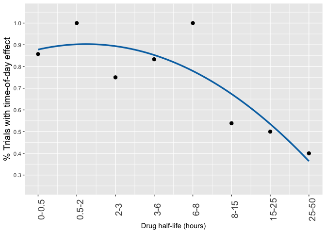

Dosing Time
================
MarcDRuben
2019-04-14

## Half-life matters

Relationship between drug half-lives and “successes” in circadian
trials. Dataset named **CircadianTrials** contains details of more than
100 human trials of dosing time. Available in this repo.

``` r
head(CircadianTrials[, 1:5])
```

    ## # A tibble: 6 x 5
    ##    year drug            halflife.hr therapeutic.area             effect.bin
    ##   <dbl> <chr>                 <dbl> <chr>                        <chr>     
    ## 1  1997 oxaliplatin, f…         0.5 colorectal cancer            eff/tox   
    ## 2  1990 oxaliplatin             0.5 mixed cancers (breast carci… eff/tox   
    ## 3  1994 oxaliplatin, f…         0.5 colorectal cancer            eff/tox   
    ## 4  2000 granulocyte-ma…        NA   soft tissue or bone sarcoma  eff/tox   
    ## 5  2006 oxaliplatin, f…         0.5 colorectal cancer            eff/tox   
    ## 6  2009 radiotherapy           NA   head and neck cancer         eff/tox

<!-- -->
